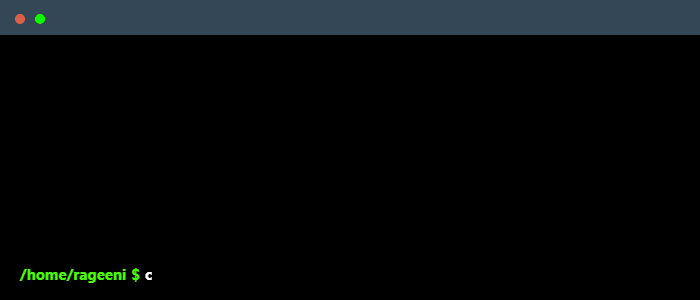

    

---

### About me

I'm a Python backend developer who enjoys building systems that do useful, real-world work — APIs, backend platforms, and tools that automate workflows.

At Capgemini, I work on backend services for enterprise applications. Outside of work, I build independent projects like CraftCore, a Django marketplace platform, and LinkCode, a Chrome extension published on the Chrome Web Store.

I’m particularly interested in backend architecture, API design, and building reliable systems that scale cleanly. I enjoy understanding how things work under the hood and improving systems to make them simpler and more efficient.

Most of my work revolves around Python, Django, REST APIs, and database-driven applications.

I like building things that are simple, useful, and built to last.

---

### Tech stack

**Programming Languages:** Python, SQL

**Backend Frameworks:** Django, Django REST Framework (DRF), Flask

**API Development:** RESTful APIs, Authentication (JWT, OAuth2)

**Databases & ORM:** PostgreSQL, MySQL, SQLAlchemy, MongoDB

**Backend Architecture:** Redis Caching, Celery, Message Queues, Async Programming, Microservices

**Python Libraries:** Pandas, NumPy, Requests

**AI & Modern Tools:** LLM APIs (OpenAI, Gemini)

**Cloud & DevOps:** Docker, AWS, CI/CD Pipelines

**Tools & Platforms:** Postman, Git, GitHub, PyCharm, VS Code, Jupyter Notebook

---

### Repositories

#### <a href="https://github.com/rageenidawale/craftcore-hackathon">CraftCore — Django Marketplace</a>
Marketplace platform with authentication, product lifecycle, and order management.

#### <a href="https://github.com/rageenidawale/linkcode-leetcode-github-sync">LinkCode — Chrome Extension</a>   

Chrome extension that automatically syncs LeetCode submissions to GitHub.

<a href="https://chromewebstore.google.com/detail/linkcode-leetcode-github/dglnhlkedekgdkdpmjollhabaomlgalc">
Check out the Extension
</a> 

### 

---

### Current Focus

- Backend architecture
- Django and REST APIs
- Building production-grade systems
- Creating tools and automation

---

### Connect with me

---

### Employer?

> [!IMPORTANT]  
>  
> <a href="https://drive.google.com/file/d/18xEWBDSD8u0As64ai_OGS74FOQnH3LCe/view?usp=drive_link" target="_blank">
>   
> </a>

---

<picture>
  

    
  

</picture>

